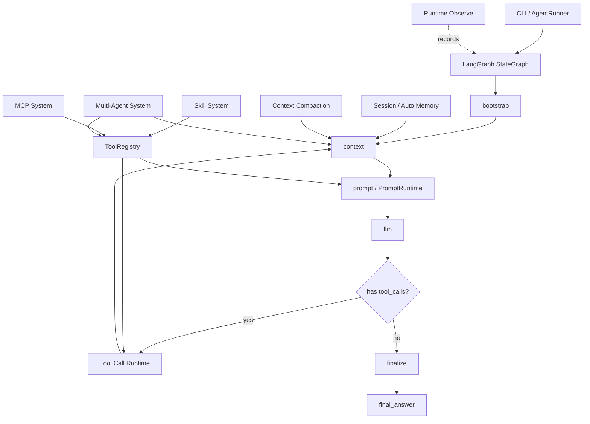
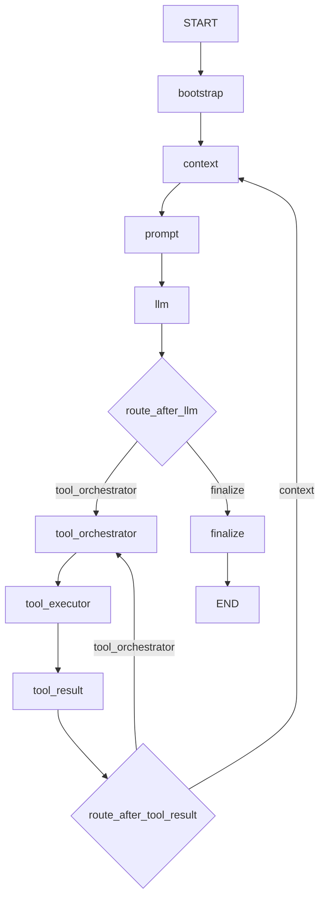
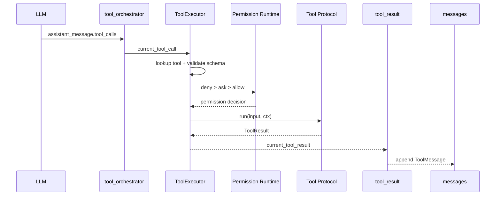
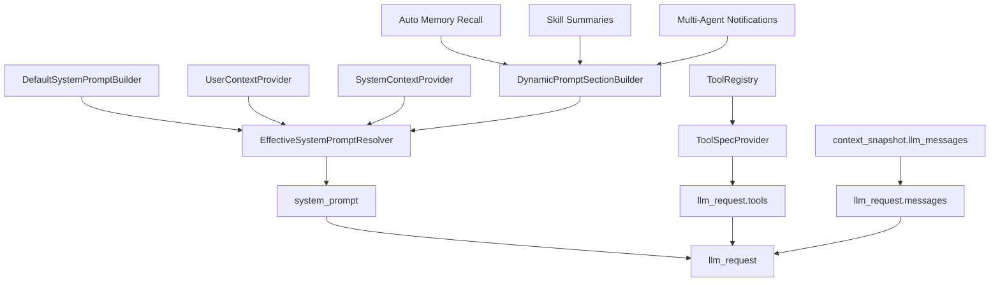
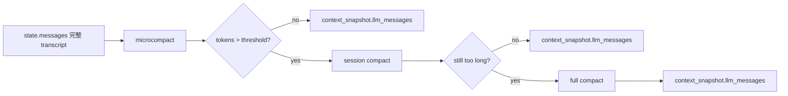
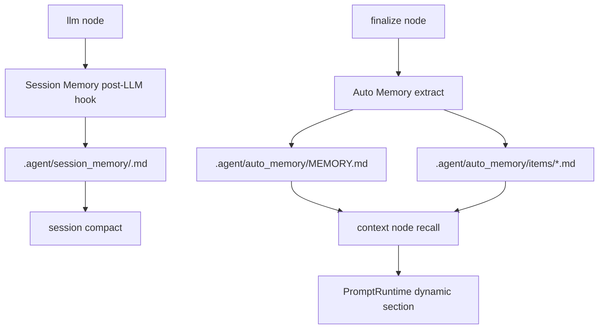
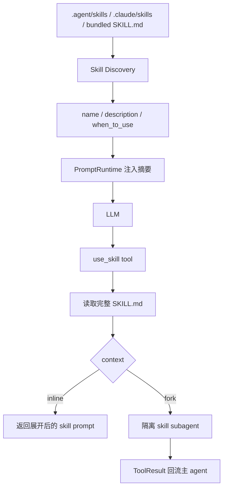
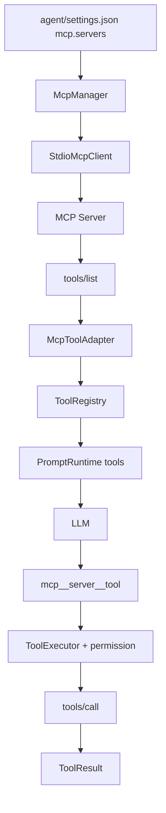
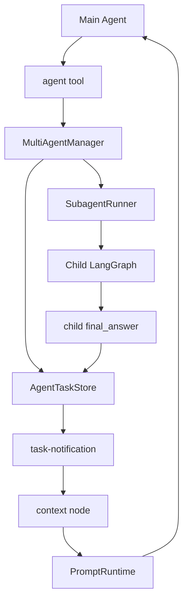
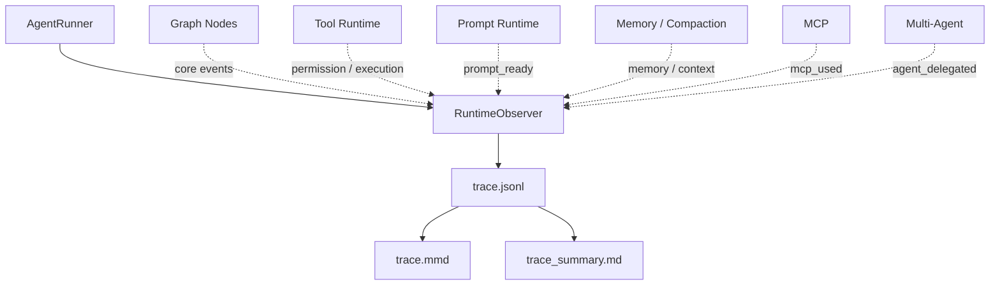

# GraphClaude

基于 Claude Code 设计哲学和 LangGraph 构建的 coding agent。项目重点不只是“能调用工具”，而是把一个 coding agent 拆成可解释、可扩展、可观测的 runtime：Graph 负责状态流转，Prompt Runtime 负责分层 prompt 构造，Tool Runtime 负责统一工具协议与权限，Memory/Context Compaction 负责长任务上下文，Skill/MCP/Multi-Agent 通过同一 ToolRegistry 接入工具闭环。

## 项目亮点

- **LangGraph Agent Runtime**：使用 `StateGraph` 构建 `bootstrap -> context -> prompt -> llm -> tool loop -> finalize` 主循环。
- **Tool Call Runtime**：将工具调用拆分为 orchestrator 调度层和 executor 执行层，所有工具实现统一 Tool Protocol，并集中执行 `deny > ask > allow` 权限决策。
- **分层 Prompt Runtime**：将 default/user/system/dynamic prompt sections 分层构造，再通过 resolver 合成最终 `system_prompt`，工具规格由独立 `ToolSpecProvider` 生成。
- **分层上下文压缩**：通过 `microcompact -> session compact -> full compact` 逐级压缩 LLM 输入，同时保留完整 transcript 供 debug 和 memory 使用。
- **记忆系统**：Session Memory 支撑当前会话摘要和 session compact，Auto Memory 支撑跨 run 的长期偏好、反馈和非显然知识召回。
- **Skill / MCP / Multi-Agent 扩展**：Skill、MCP server tools、多 agent 协作工具都适配为统一 Tool，进入相同权限、执行、结果回流链路。
- **Runtime Observe**：默认 `core` profile 输出面试展示用核心事件流，生成 `trace.jsonl`、`trace.mmd`、`trace_summary.md`。

## 目录结构

```text
graph-claude/
  agent/
    main.py                     # CLI 入口
    config.py                   # OpenAI-compatible ChatOpenAI 配置
    settings.json               # permissions / skills / prompt / mcp / multi_agent 配置
    graph/
      build_graph.py            # StateGraph 构建入口
      state.py                  # AgentState 数据总线
      routes.py                 # graph route 决策
      observed.py               # node / route observe wrapper
      nodes/                    # bootstrap/context/prompt/llm/tool/finalize nodes
    tools/
      base.py                   # Tool Protocol / ToolContext / ToolResult
      executor.py               # ToolExecutor：校验、权限、执行
      permissions.py            # deny > ask > allow 权限规则
      registry.py               # ToolRegistry
      file_tools/               # read_file / write_file
      tool_list.md              # tools 说明
    prompt/
      runtime.py                # PromptRuntime 主入口
      defaults.py               # default prompt sections
      contexts.py               # user/system context providers
      dynamic.py                # memory/skill/multi-agent dynamic sections
      tools.py                  # ToolSpecProvider
      resolver.py               # effective system prompt resolver
      dump.py                   # prompt snapshot
    memory/
      context_compaction/       # microcompact / session compact / full compact
      session_memory/           # 当前 session 的滚动摘要
      auto_memory/              # 跨 run 长期记忆
    skills/                     # SKILL.md discovery / use_skill / shell prompt
    mcp/                        # MCP stdio client / tool adapter / manager
    multi_agent/                # subagent / coordinator / teammate runtime
    observe/                    # trace.jsonl / trace.mmd / trace_summary.md
    runtime/
      runner.py                 # AgentRunner：run 生命周期和 observe 输出 
  examples/
    demo_project/               # demo workspace
  tests/                        # 单元测试和集成测试
```

## 整体结构



## Agent Graph



Graph 的核心循环是：

```text
context -> prompt -> llm -> tool_orchestrator -> tool_executor -> tool_result -> context
```

当 LLM 不再产生 tool call 时，进入 `finalize` 输出最终答案。

## Tool Call 系统



设计重点：

- `tool_orchestrator` 只负责 FIFO 调度，不执行工具、不校验权限。
- `ToolExecutor` 统一负责工具查找、schema 校验、permission、执行和错误封装。
- 所有工具都实现统一 Tool Protocol：内置文件工具、Skill、MCP、多 Agent 协作工具共享同一执行闭环。
- 权限机制集中在 executor，按 `deny > ask > allow` 执行，结合 settings rules、permission mode、工具只读/破坏性属性决策。

## Prompt Runtime



Prompt Runtime 的分层：

- `default`：agent 基础行为。
- `user`：用户上下文。
- `system`：当前日期、workspace、git status、CLAUDE.md 等系统上下文。
- `dynamic`：记忆召回、Skill 摘要、条件 Skill、多 Agent 通知。
- `tools`：不属于 dynamic prompt，由 `ToolSpecProvider` 从 `ToolRegistry` 独立生成。

## 上下文管理与压缩



三层压缩策略：

- **Microcompact**：清空旧 ToolMessage 正文，保留 tool_call_id/name/status，低成本减少旧工具结果占用。
- **Session Compact**：读取 `<workspace>/.agent/session_memory/<session_id>.md`，用会话摘要替换早期上下文。
- **Full Compact**：极长上下文下调用 LLM 生成全局摘要，并拼接最近消息。

压缩只影响 `context_snapshot.llm_messages`，不覆盖 `state.messages`。

## 记忆系统



- **Session Memory**：当前 thread 的滚动工作摘要，服务长上下文压缩和任务恢复。
- **Auto Memory**：跨 run 的长期记忆，只保存用户偏好、反馈和不可从代码/Git/文档直接推导的信息。

## Skill 系统



Skill 采用两阶段加载：prompt 中只注入摘要，调用 `use_skill` 时才读取完整 `SKILL.md`。默认 fork 执行，避免污染主上下文。

## MCP 系统



当前支持 stdio MCP transport，默认配置了 time/fetch，GitHub MCP 预留 Docker 配置。MCP tool 统一命名为 `mcp__{server}__{tool}`，缺少 readOnlyHint 时默认按 destructive 工具处理。

## 多 Agent 系统



支持：

- 普通 subagent：同步委派并返回结果。
- background subagent：返回 `task_id`，通过 `agent_poll` 查询。
- coordinator mode：通过 Prompt Runtime 注入 coordinator prompt。
- teammate：使用 `.agent/teams/<team>/` 下的 team/task/inbox 文件协作。

## Runtime Observe



默认 observe profile 为 `core`，输出面试展示用核心链路：

```text
.runs/run_xxx/
  trace.jsonl
  trace.mmd
  trace_summary.md
```

`trace_summary.md` 是最适合面试现场展示的入口，能快速看到任务、核心时间线、工具调用、权限决策、上下文/记忆和扩展系统使用情况。

## 快速开始

### 1. 安装依赖

```powershell
uv sync
```

### 2. 配置模型 API Key

当前 `agent/config.py` 使用 OpenAI-compatible `ChatOpenAI`，默认读取：

```powershell
$env:FUNHPC_API_KEY="your_api_key"
```

如果要切换到 DeepSeek/OpenAI/其他兼容服务，修改 [agent/config.py](./agent/config.py) 中的：

```python
api_key = os.getenv("FUNHPC_API_KEY")
model_name = "Qwen3-Coder-30B-A3B-Instruct"
base_url = "https://funhpc.com/v1"
```

### 3. 运行

```powershell
uv run python -m agent.main `
  --thread demo-summary `
  --workspace ./examples/demo_project `
  --input "Read src/math_utils.py and write SUMMARY.md summarizing the functions."
```

如果工具触发写文件权限确认，按 CLI 提示批准即可。也可以使用：

```powershell
uv run python -m agent.main `
  --thread demo-summary `
  --workspace ./examples/demo_project `
  --permission-mode accept_edits `
  --input "Read src/math_utils.py and write SUMMARY.md summarizing the functions."
```

### 4. 查看 observe 结果

运行后查看：

```text
.runs/run_xxx/trace_summary.md
.runs/run_xxx/trace.mmd
.runs/run_xxx/trace.jsonl
```

按 observation id 查看某条记录：

```powershell
uv run python -m agent.observe.trace_reader .runs\run_xxx\trace.jsonl <observation_id>
```

### 5. 运行测试

```powershell
uv run pytest
uv run python -m compileall agent tests
```

当前项目测试覆盖：

- graph runtime
- tool call chain
- permission
- context compaction
- session memory / auto memory
- prompt runtime
- skills
- MCP
- multi-agent
- runtime observe
